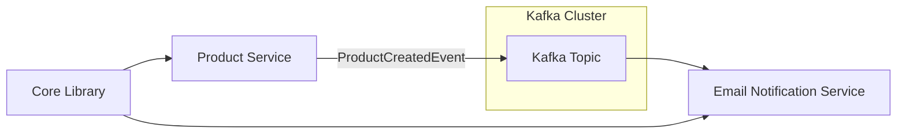

# 🚀 Kafka Microservices Event-Driven System


---

## 📌 Overview

This project demonstrates a **Kafka-based event-driven microservices architecture** using Spring Boot.

It consists of:

- 📦 **Product Service (Producer)** → Publishes product events to Kafka
- 📧 **Email Notification Service (Consumer)** → Listens and processes events
- 🧠 **Core Library** → Shared DTOs and event models
- 🐳 **Kafka Infrastructure** → Running via Docker Compose

---

# 🧱 Architecture



---

# 📁 Project Structure

```
kafka/
│
├── product-service/        → Kafka Producer (Spring Boot)
├── email-service/          → Kafka Consumer (Spring Boot)
├── core/                   → Shared DTOs & event models
│
├── infra/
│   └── docker-compose.yml  → Kafka setup
│
└── README.md
```

---

# ⚙️ Tech Stack

- Java 17+
- Spring Boot
- Apache Kafka
- Docker & Docker Compose
- Maven (multi-module setup)

---

# 🐳 Kafka Setup (Windows + Docker)

## 1. Install Docker Desktop

https://www.docker.com/products/docker-desktop/

Enable:

- WSL2 backend
- Restart system if required

---

## 2. Start Kafka

```bash
cd infra
docker-compose up -d
```

---

## 3. Verify containers

```bash
docker ps
```

---

# 🚀 Running the System

## 1. Start Kafka first

```bash
cd infra
docker-compose up -d
```

---

## 2. Build shared core

```bash
cd core
mvn clean install
```

---

## 3. Start Product Service

```bash
cd product-service
mvn spring-boot:run
```

---

## 4. Start Email Service

```bash
cd email-service
mvn spring-boot:run
```

---

# 🧪 Testing

```http
POST http://localhost:xxxxx/products
```

```json
{
  "name": "MacBook Pro",
  "price": 2500
}
```

---

# 📡 Topic

- product-created-events-topic

---

# 🧰 Useful Commands

```bash
kafka-topics --list --bootstrap-server localhost:9092
```

```bash
kafka-consumer-groups --describe --group product-created-events-v2 --bootstrap-server localhost:9092
```

---

# 📈 Future Improvements

- Retry + DLQ
- Schema Registry
- Observability (Micrometer + Grafana)
- Kubernetes deployment
- Security (SSL/ACL)

---

# 👨‍💻 Author

Kafka event-driven learning project using Spring Boot microservices.
